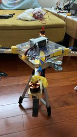
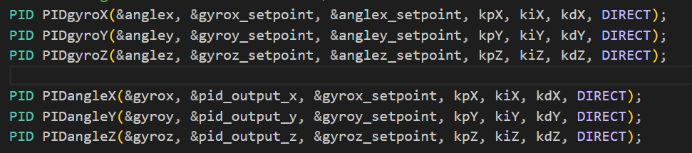
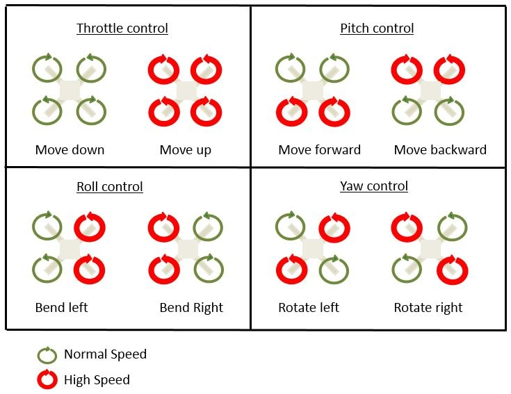

 Quadcopter Project: Advanced Movement Control

## Introduction

This document details the advanced movement control system implemented in the Quadcopter Project, focusing on the use of a cascading PID (Proportional-Integral-Derivative) control system to manage the pitch, roll, and yaw movements. The integration of these technologies ensures precise and responsive maneuvering of the quadcopter.

- Click this link below to the remote controler source code:
- [Drone Remote Controller](https://github.com/CuongNguyen-rmit/Remote_GroupG)

## Quadcopter Layout and Components

### ESP32 and Control System
- Central to the quadcopter's control system is the **ESP32** microcontroller.
- It acts as the brain of the quadcopter, processing inputs and managing communication.

### Electronic Speed Controllers (ESCs)
- Four **ESCs** are connected to the ESP32.
- Each ESC is responsible for controlling one **Brushless DC (BLDC) motor**, providing precise speed control.

### BLDC Motors
- The quadcopter is equipped with four **BLDC motors**.
- These motors provide the necessary thrust and maneuverability for the quadcopter.

### MPU6050 - Motion Processing Unit
- Connected to the ESP32, the **MPU6050** sensor module provides gyroscopic and accelerometer data.
- This data is crucial for stabilizing the quadcopter and for pitch, roll, and yaw adjustments.

### GPS Neo8m Module
- The **GPS Neo8m module** offers location tracking capabilities.
- It provides valuable data for navigation and autonomous flight features.

### Power Distribution Board (PDB) and Battery
- All components are connected to a **Power Distribution Board (PDB)**.
- The quadcopter is powered by a **LiPo 4s battery**, ensuring adequate power supply for extended flight times.

## PCB Design of the drone
- The wiring diagram outlines the power distribution and communication pathways for a drone system, featuring a PDB XT60 that distributes power from a 14.8V Lipo battery to four 30A Brushless ESCs, which in turn control individual motors via PWM signals from the ESP32 microcontroller pins GPIO32, GPIO33, GPIO25, and GPIO26. Additionally, the ESP32 is powered through its VIN pin by a regulated 5.0V output from the PDB. The MPU6050 sensor, requiring a 3.3V supply, is connected to the ESP32's 3V3 pin and communicates via I2C, with SCL and SDA lines attached to pins 22 and 21 of the ESP32, strategically placed to avoid interference from the PWM signals. Furthermore, the GPS NEO8M module, utilizing UART communication, connects its RX pin to the ESP32's TX2 on pin 17 and its TX to the ESP32's RX2 on pin 16, ensuring precise satellite signal reception and location tracking for the drone. UART2 is preferred because UART0 serves as the USB port, and UART1 is allocated for SPI flashing. The electrical circuit of the drone in milestone 1.2 is present in the diagram below. 
- The diagram below is the PCB layout for quadcopter

## Cascading PID Control for Movement

### Overview of Cascading PID
- A **Cascading PID** system involves multiple layers of PID controllers, each responsible for different aspects of control.
-  In this setup, there are two layers of PID controllers. The first layer of PID controllers can be dedicated to managing the primary movements such as pitch, roll, and yaw based on the gyroscope readings. These controllers intermediately set to the setpoints for the second layer of controllers. 

The second layer of PID controllers then focuses on calculate the singal sent to motors by precisely controlling the angles based on the setpoints provided by the first layer. This cascading approach allows for a more variables and responsive handling of the drone's motion due to the axis in X,Y and Z leading to more accurate and stable control. 

The key advantage of this cascading PID system is the ability to handle multiple variables at the same time. By dividing the complex task of flight control into multiple controllers, each focusing on a specific aspect of the motion, the drone can achieve a more stable and responsive flight.

### Pitch-Roll-Yaw Control
#### Pitch control
- **Objective**: To manage the forward and backward tilt.
- **Outer Loop PID**: Focuses on desired pitch angle, setting a target for the inner loop.
- **Inner Loop PID**: Directly controls motor speeds to achieve the desired pitch angle.
- **Benefits**: Allows for precise control of forward and backward movements, essential for smooth flight.
#### Roll Control
- **Objective**: To manage the side-to-side tilt.
- **Outer Loop PID**: Sets the target roll angle based on desired lateral movement.
- **Inner Loop PID**: Adjusts motor speeds to match the target roll angle.
- **Benefits**: Enables precise control over left and right movements, critical for maintaining balance and direction.

#### Yaw Control
- **Objective**: To control the rotation around the vertical axis.
- **Outer Loop PID**: Determines the target yaw angle for directional orientation.
- **Inner Loop PID**: Modifies the rotational speeds of the motors to achieve the target yaw angle.
- **Benefits**: Essential for accurate directional control, allowing the quadcopter to face and move in the desired direction.

## Quadcopter movement concept
- When the quadcopter needs to pitch forward, the speed of the rear motors increases, while the front motors slow down, tilting the quadcopter forward. For rolling, one side's motors speed up, and the opposite side's motors slow down, causing the quadcopter to lean and move sideways. Yawing is achieved by creating a differential in rotational direction or speed between the motors on opposite sides.

